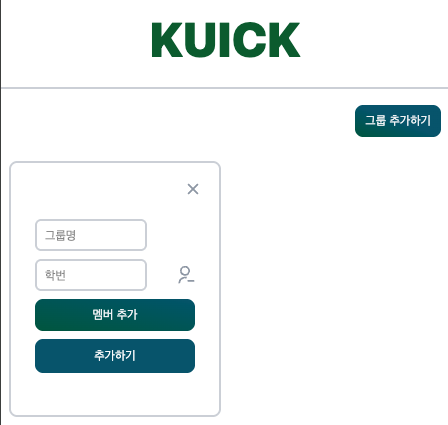
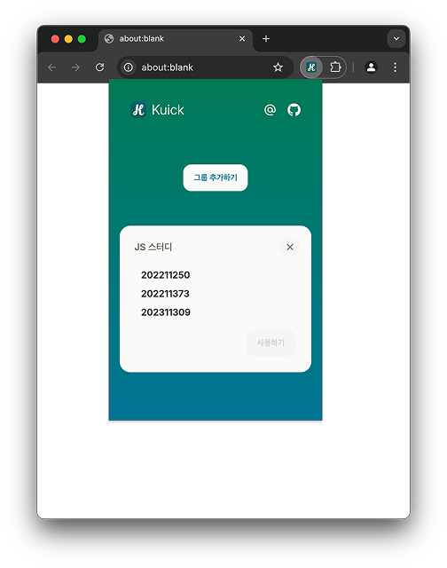
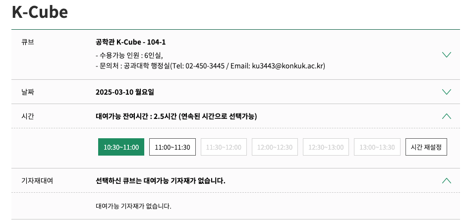
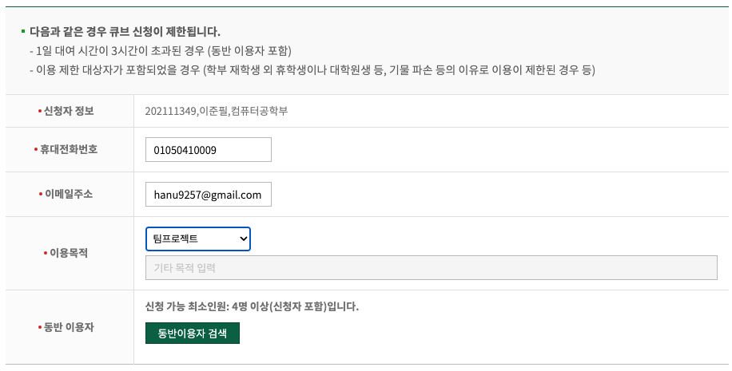
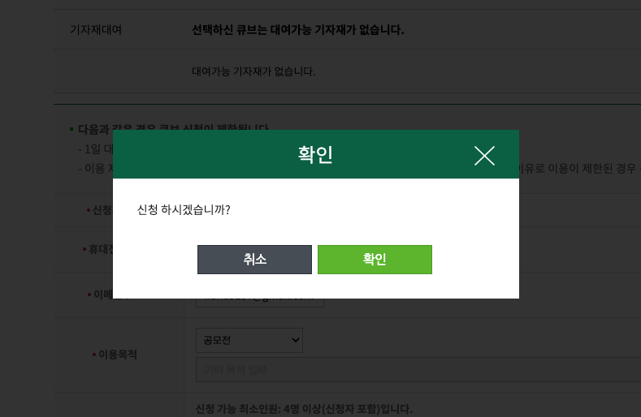
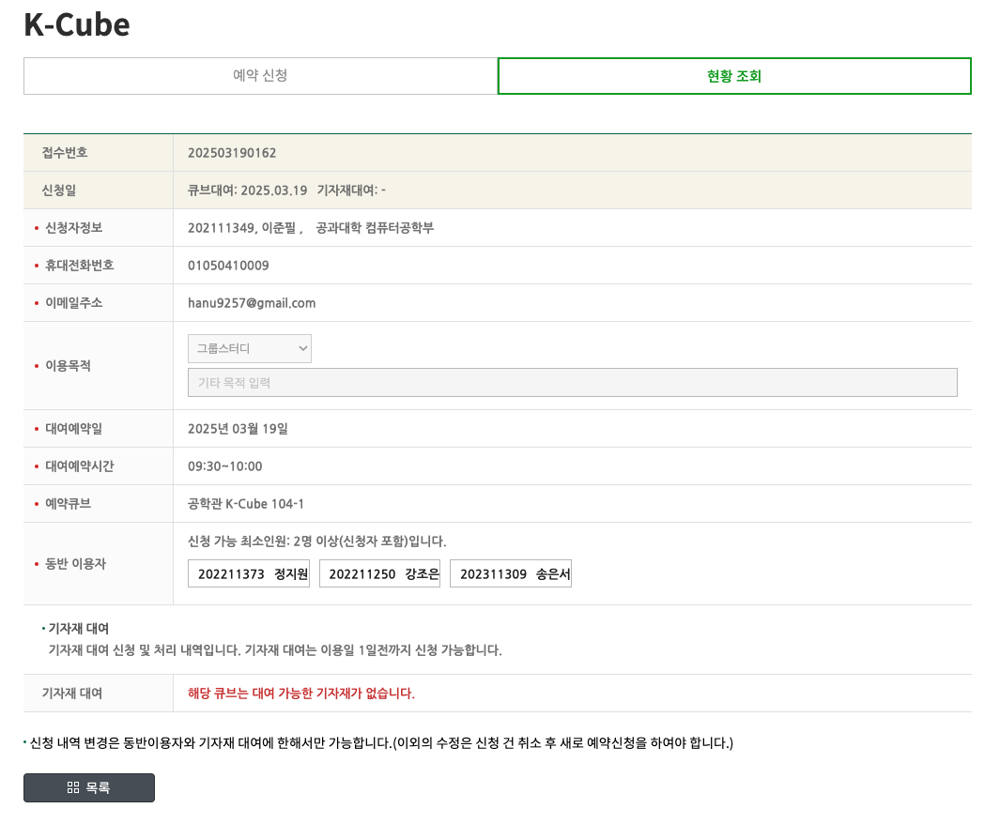

# Kuick

## 사용법

### 1. 새로운 그룹 추가하기 ⏰

그룹 추가하기 버튼을 클릭해 새로운 그룹을 생성할 수 있어요.

만약 멤버를 추가하고 싶을 경우에는 멤버 추가 버튼을, 멤버를 삭제하고 싶을 때는 우측의 아이콘을 눌러주세요.

그룹이 추가되고 나면 이렇게 등록된 멤버의 학번과 사용하기 버튼이 생겨요.

### 2. 대여 희망 장소 및 시간 선택 🧭

[k-cube 예약 페이지](https://wein.konkuk.ac.kr/ptfol/cmnt/cube/findUseInfo.do)에 들어가서 원하는 공간과 시간을 선택해요.

### 3. 익스텐션의 사용하기 버튼 클릭 ✨

이용 목적을 등록한 후에 익스텐션을 열고 원하는 그룹의 사용하기 버튼을 클릭해요.

동반 이용자가 자동으로 등록되고 다음과 같이 신청 확인 메시지가 떠요.

마지막으로 확인 버튼을 누르면 공간 대여 신청이 완료돼요. 👍

